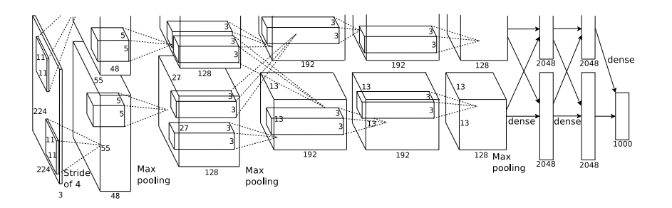
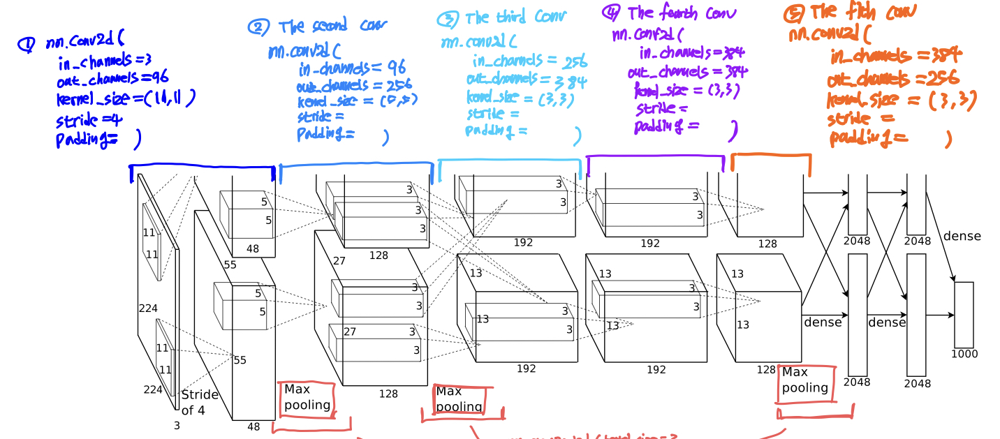
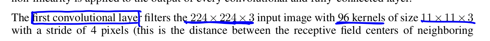
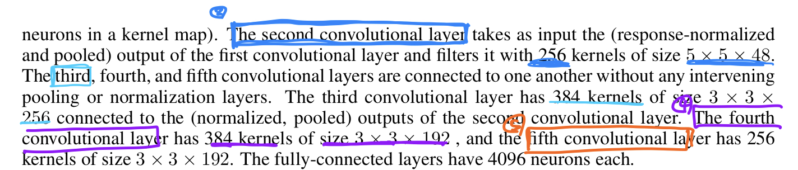
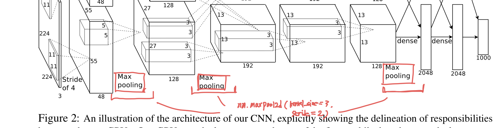
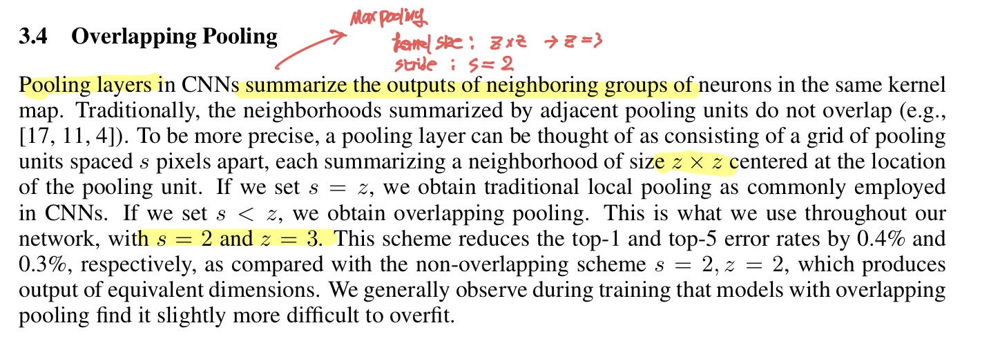
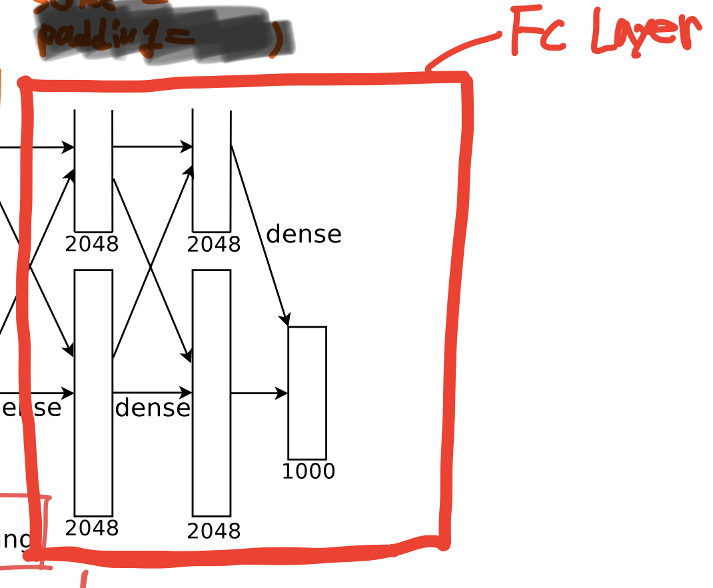
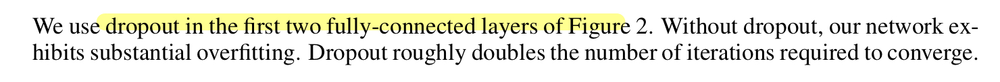
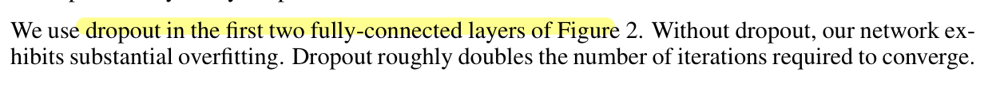

# AlexNet Implementation



- 주요 pytorch의 클래스
    - CONV2D
    - MAXPOOL2D
    - LINEAR
    - Dropout
    

## CONV2D


- torch.nn.Conv2d에서 채워야할 인자
    - in_channels
    - kernel_size
    - stride
    - padding
    

- 5개의 Conv2d로 구성되며 stride, padding을 제외한 값은 논문 그림과 설명을 통해 확인할 수 있다.







- [https://www.datasciencecentral.com/alexnet-implementation-using-keras/](https://www.datasciencecentral.com/alexnet-implementation-using-keras/) *를 참고하여 나머지 stride, padding 값을 채워 넣는다.

```python
# The first convolutional layer
nn.Conv2d(in_channels = 3, out_channels = 96, kenerl_size = (11, 11), stride = 4, padding = 0 )

# The second convolutional layer
nn.Conv2d(in_channels = 96, out_channels = 256, kenerl_size = (5, 5), stride = 1, padding = 2 )

# The third convolutional layer
nn.Conv2d(in_channels = 256, out_channels = 384, kenerl_size = (3, 3), stride = 1, padding = 1 )

# The fourth convolutional layer
nn.Conv2d(in_channels = 384, out_channels = 384, kenerl_size = (3, 3), stride = 1, padding = 1 )

# The fifth convolutional layer
nn.Conv2d(in_channels = 384, out_channels = 256, kenerl_size = (3, 3), stride = 1, padding = 1 )
```

## MAXPOOL2D


- torch.nn.MaxPool2d에서 채워야 할 인자
    - kenel_size
    - stride
    - padding
    
- MaxPool2d의 경우 첫번째, 두번째 그리고 마지막 CONV2D 뒤에 위치한다. (총 3개)



- kernel_size = 3, stride = 2



```python
nn.MaxPool2d(kernel_size = 3, stride = 2)
```

## LINEAR


- torch.nn.Linear에서 채워넣어야 할 인자
    - in_features
    - out_features



- nn.linear가 후반에 3개 위치하는 것을 알 수 있다.



```python
nn.Linear(in_features = 256*6*6, out_features = 4096)

nn.Linear(in_features = 4096, out_features = 4096)

nn.Linear(in_features = 4096, out_features = 1000)
```

## Dropout



## AlexNet Class

```python
class AlexNet(nn.Module):
    def __init__(self):
        super(AlexNet, self).__init__()
        # Image input_size=(3, 227, 227)
        self.layers = nn.Sequential(
						# The first Convolution
            nn.Conv2d(in_channels=3, out_channels=96, kernel_size=(11, 11), stride=4, padding=0), 
            nn.ReLU(), 

            nn.MaxPool2d(kernel_size=3, stride=2),

						# The second Convolution
            nn.Conv2d(in_channels=96, out_channels=256, kernel_size=(5, 5), stride=1, padding=2),
            nn.ReLU(),

            nn.MaxPool2d(kernel_size=3, stride=2), 

						# The third Convolution
            nn.Conv2d(in_channels=256, out_channels=384, kernel_size=(3, 3), stride=1, padding=1),
            nn.ReLU(),

						# The fourth Convolution
            nn.Conv2d(in_channels=384, out_channels=384, kernel_size=(3, 3), stride=1, padding=1),
            nn.ReLU(),

						# The fifth Convolution
            nn.Conv2d(in_channels=384, out_channels=256, kernel_size=(3, 3), stride=1, padding=1),
            nn.ReLU(),

            nn.MaxPool2d(kernel_size=3, stride=2), 
        )
        self.classifier = nn.Sequential(
            nn.Dropout(p=0.5),
            nn.Linear(in_features=256*6*6, out_features=4096),
            nn.ReLU(),
            nn.Dropout(p=0.5),
            nn.Linear(in_features=4096, out_features=4096),
            nn.ReLU(),
            nn.Linear(in_features=4096, out_features=1000),
        )
    
    def forward(self, x):
        x = self.layers(x)
        x = x.view(-1, 256*6*6)
        x = self.classifier(x)
        return x
```

## Notice !!

AlexNet의 마지막 fc_layer의 out_features의 경우 사용하는 데이터셋의 클래스 수에 맞춰서 설정해야 한다. 본 코드에서는 1000으로 설정되어 있으며 만약 클래스가 2인 경우 out_features = 2로 수정해야 한다.

### Reference
* ImageNet Classification with Deep Convolutional Neural Networks
* https://pytorch.org/
